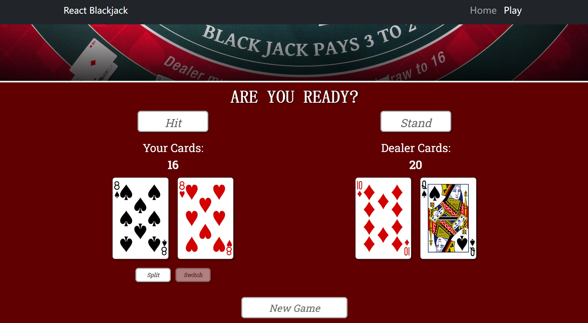

# React Blackjack  

### Overview  
A Blackjack game written in React.js. The app uses Axios to generate a deck of card 
from the [Deck of Cards API](https://deckofcardsapi.com/).  Game can be found from [Blackjack Game](https://blackjack-simulator.onrender.com).

### Features  
- An app that users can use to play hands of Blackjack  
- Generate cards from an external API  
- Uses functions to handle dealing cards, and player decisions like 'hit' and 'stand'  
- Uses logic to figure out which hand is higher without going over 21 to determine the winner  
- Manipulates DOM to display cards, and the results for each hand  
- Users can click the "New Game" button to start a new game  

### Tech used 
JavaScript, React.js, Axios, Bootstrap, CSS, HTML. 

### Getting Started 
Step 1: Clone or download the repo.  
Step 2: Install project dependencies listed in package.json by running: `npm install`.  
Step 3: Compile and launch the app by running: `npm start`.  
Step 4: Open and run the app at http://localhost:3000  

### Contact  
Developer: Zixuan Gao               
LinkedIn: https://www.linkedin.com/in/zixuan-gia/   
GitHub: https://github.com/ZixuanGao23206703

