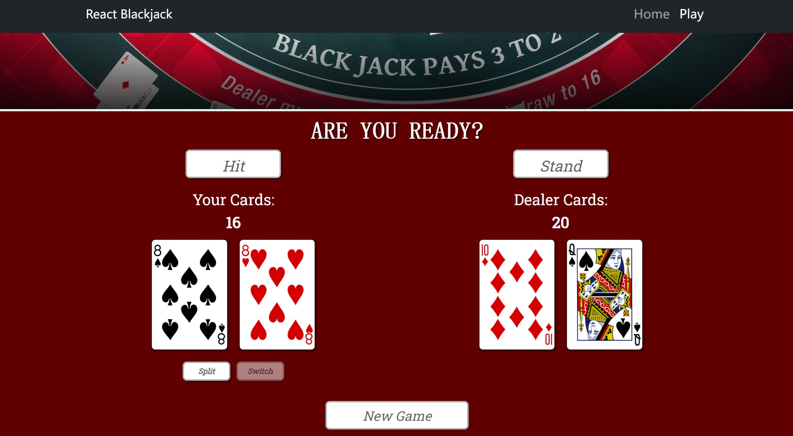

# Simulating Blackjack with Python

### Overview  
A Blackjack game written in React.js. The app uses Axios to generate a deck of card 
from the [Deck of Cards API](https://deckofcardsapi.com/).  

### Visualize the Game

<video width="600" controls>
  <source src=""C:/BlackjackModify/src/React-Blackjack.mp4"" type="video/mp4">
  </video>

### Getting started
 

### React-Blackjack Game

### Data

### Contact  
Developer: Zixuan Gao               
LinkedIn: https://www.linkedin.com/in/zixuan-gia/   
GitHub: https://github.com/ZixuanGao23206703

